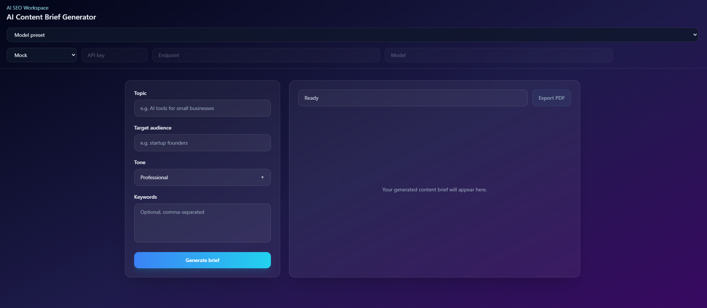
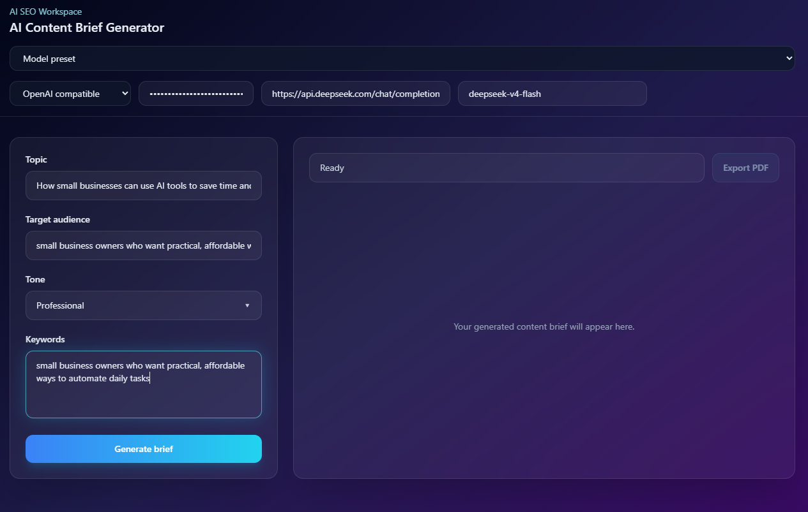
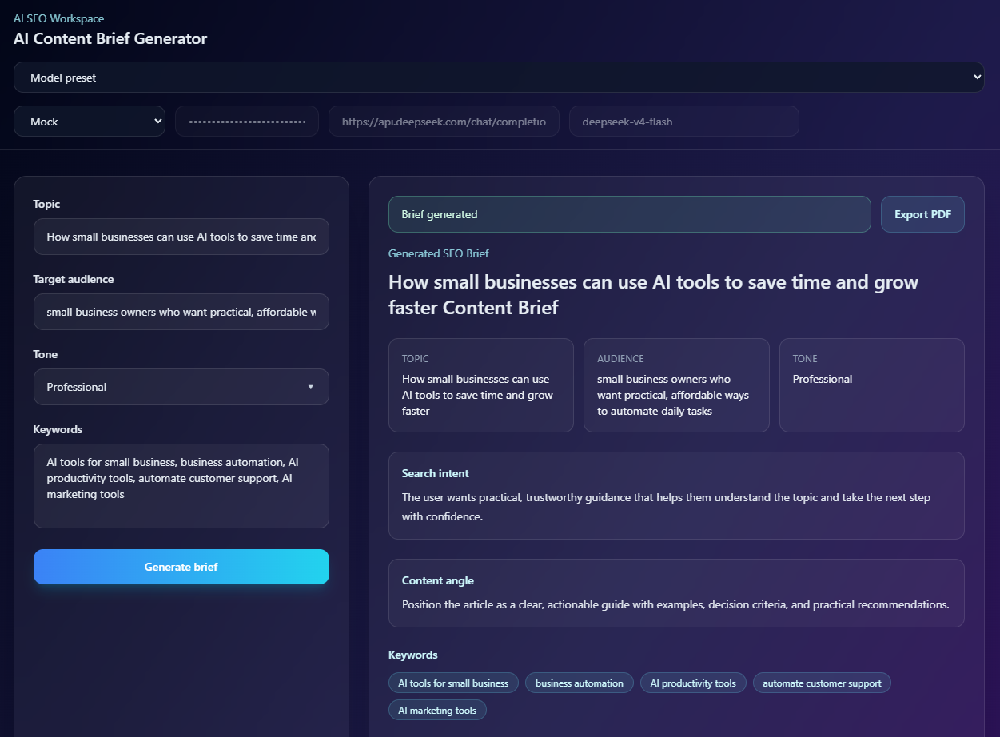

# AI Content Brief Generator

A modern React + TypeScript + Vite web app for generating structured SEO content briefs with AI streaming responses.

The app is designed as a provider-agnostic AI workspace. It can run in demo mode without any API key, or connect to Claude and OpenAI-compatible providers when credentials are available.

## Features

- Generate structured SEO content briefs from a topic, audience, tone, and optional keywords
- Demo mode with a built-in Mock provider, no API key required
- Claude provider support
- OpenAI-compatible provider support
- Popular AI model presets
- Manual SSE streaming parsing
- Structured JSON parsing with fallback warning
- Glassmorphism SaaS interface
- API key stored only in React state
- PDF export with jsPDF
- Loading skeleton with shimmer
- Streaming text cursor
- Error, warning, loading, idle, and success states
- Strict TypeScript architecture

## Tech Stack

- React 18
- TypeScript
- Vite
- Tailwind CSS v3
- jsPDF
- Claude API
- OpenAI-compatible Chat Completions APIs

## Project Structure

```txt
src/
├── app/
├── components/
├── hooks/
├── lib/
├── prompts/
├── services/
│   └── providers/
├── styles/
└── types/
```

## Getting Started

Install dependencies:

```bash
npm install
```

Start the development server:

```bash
npm run dev
```

Create a production build:

```bash
npm run build
```

## Screenshots

### Empty State



### Generating State



### Generated Brief



## How To Test Without An API Key

Use the default `Mock / Demo` model preset.

This mode does not call any external AI provider. It streams a realistic JSON response locally so you can test:

- the form flow
- streaming output
- JSON parsing
- structured brief rendering
- loading states
- PDF export
- README screenshots

Recommended screenshot states:

1. Empty state with the form and `Ready` status
2. Generating state with streaming text or skeleton loading
3. Generated state with a structured brief and active `Export PDF` button

## AI Providers

The app supports three provider modes.

### Mock

Use this for demos, local testing, screenshots, and UI development.

No API key, endpoint, or model is required.

### Claude

Default endpoint:

```txt
https://api.anthropic.com/v1/messages
```

Required browser-access header:

```txt
anthropic-dangerous-direct-browser-access: true
```

Example model:

```txt
claude-sonnet-4-20250514
```

### OpenAI-Compatible

Use this mode for providers that support the OpenAI Chat Completions streaming format.

Example OpenAI endpoint:

```txt
https://api.openai.com/v1/chat/completions
```

Example OpenRouter endpoint:

```txt
https://openrouter.ai/api/v1/chat/completions
```

Example Google Gemini OpenAI-compatible endpoint:

```txt
https://generativelanguage.googleapis.com/v1beta/openai/chat/completions
```

## Model Presets

The app includes presets for well-known AI providers and models.

Presets are stored in:

```txt
src/lib/aiModelPresets.ts
```

Each preset controls:

- provider type
- endpoint
- model name

The API key is not stored in presets. It is entered manually in the UI.

## API Key Handling

The API key is entered in the top bar.

Important behavior:

- stored only in React state
- not written to `localStorage`
- not written to cookies
- cleared after page refresh
- disabled when Mock mode is selected

For public production deployments, do not call paid AI APIs directly from the browser. Use a backend or serverless proxy so API keys are never exposed to users.

## Output Contract

The AI prompt instructs the model to return only valid JSON.

No markdown.
No backticks.
No explanatory text outside JSON.

Expected structure:

```json
{
  "title": "string",
  "meta": {
    "topic": "string",
    "audience": "string",
    "tone": "professional | friendly | technical | persuasive | casual",
    "keywords": ["string"]
  },
  "searchIntent": "string",
  "angle": "string",
  "keywords": ["string"],
  "outline": [
    {
      "heading": "string",
      "points": ["string"]
    }
  ],
  "faqs": ["string"],
  "callToAction": "string"
}
```

## PDF Export

After a brief is generated and parsed successfully, the `Export PDF` button becomes active.

The generated PDF includes:

- title
- topic
- audience
- tone
- keywords
- search intent
- content angle
- outline
- FAQs
- call to action
- footer branding

## Design

The interface uses a modern SaaS aesthetic:

- dark blue to purple gradient background
- glassmorphism panels
- soft borders
- cyan accent gradient
- glow focus states
- rounded-xl and rounded-2xl elements
- subtle hover interactions
- skeleton shimmer loading
- blinking cursor during streaming

## Error Handling

The app handles:

- missing API key
- missing topic or audience
- missing endpoint
- missing model name
- network request failures
- unsupported streaming responses
- invalid JSON responses

If JSON parsing fails, the raw streamed text remains visible and a warning is shown.

## Development Notes

Core files:

```txt
src/app/App.tsx
src/components/BriefForm.tsx
src/components/BriefOutput.tsx
src/components/TopBar.tsx
src/components/StatusBar.tsx
src/components/StreamingText.tsx
src/components/ExportButton.tsx
src/services/aiService.ts
src/services/providers/mockProvider.ts
src/services/providers/claudeProvider.ts
src/services/providers/openAiCompatibleProvider.ts
src/prompts/contentBriefPrompt.ts
src/lib/parseContentBrief.ts
src/lib/exportBriefToPdf.ts
src/lib/aiModelPresets.ts
src/types/brief.ts
src/types/ai.ts
```

Provider selection happens in:

```txt
src/services/aiService.ts
```

The content brief prompt lives in:

```txt
src/prompts/contentBriefPrompt.ts
```

## Limitations

- No backend
- No persistent API key storage
- Browser-side API calls expose user-entered API keys to the current session
- JSON syntax is parsed, but the object shape is not deeply runtime-validated
- Provider model names and endpoints may change over time

## Production Recommendations

For a real public product:

- add a backend or serverless AI proxy
- keep provider keys on the server
- add rate limiting
- add request validation
- add runtime schema validation for AI output
- add automated tests for parser and provider adapters
- keep model presets updated

## License

This project is for educational and portfolio use.
